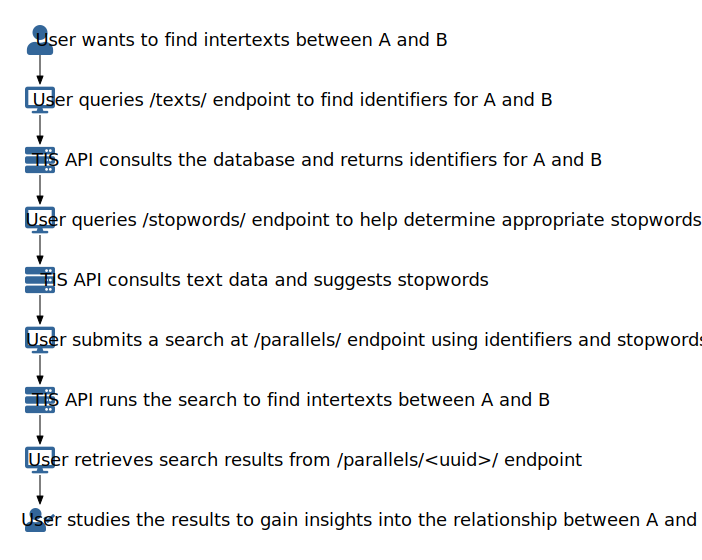

# Example Workflow

One way to imagine using the TIS API is to submit an intertextual search request and retrieve the results:



When a user desires to explore the intertextual relationship between some work A and another work B, the TIS API is one way to fulfill this goal.  The key to getting those intertextual relations through the TIS API is the [`/parallels/` endpoint](../endpoints/parallels.md).

The first step in the process is figuring out what the TIS API will understand as A and B.  Using the [`/texts/` endpoint](../endpoints/texts.md), the user could query for A by requesting a GET at `/texts/?title=A`.  Assuming there is only one work in the database called "A", the response object should contain a list with one object in it, and that object should have a field called `"object_id"`.  The associated value, which might look something like `"507f1f77bcf86cd799439011"`, is the identifier for A.  Retrieving the identifier for B would be a similar process.

The second step in the process is deciding how to ask the TIS API to perform the search for intertexts between A and B.  One key decision to make is which words to ignore when performing the search.  These ignored words are called stopwords.  Typically, words of such high occurrence in a text as to render the word mostly meaningless are good candidates as stopwords.  The TIS API can help find these high frequency words at the [`/stopwords/` endpoint](../endpoints/stopwords.md).  Supposing that A and B are Latin texts, the user might try requesting a GET at `/stopwords/?language=latin&list_size=25`.  This should return a response object containing a list of stopwords.

Another key decision is deciding how to divide the texts in searching for intertextual relations.  Since A and B happen to be poetic works, it could make sense to search for intertextual relations by line.  The other option is to look by phrase.  Since looking by phrase could catch intertextual relations involving enjambment, the user decides divide the texts by phrase.  To specify this decision for A, the user composes the following JSON object:

```json
{
  "object_id": "507f1f77bcf86cd799439011",
  "units": "line"
}
```

The JSON object for B looks very similar, except the `"object_id"` field has B's identifier.

Other key decisions must be made to finish filling out the object necessary for a search request, including what search method to use.  Details can be found on the [Scoring Methods](../details/methods.md) page, but let's assume that the user wants to run the original Tesserae search.  Looking under [Method Parameterization](../details/methods.md#method-parameterization), the user sees that specifying options for the search method will take the form of a JSON object.  Now, the user can choose appropriate options for each of the required fields in the JSON object.

The `"name"` field is already determined to be `"original"`, so no further decision needs to be made there.

The `"feature"` field requires a decision on how to count words that match.  Since the user is working with Latin and is more interested in matching words with the same lemma than matching words on exact form, it would be appropriate to choose `"lemma"` for this field.

The `"stopwords"` field requires a list of stopwords.  Luckily, the user has already retrieved a list of stopwords from the `/stopwords/` endpoint and can use that here.

The `"freq_basis"` field requires deciding how to calculate word frequencies, which are used to score how strong an intertextual relation seems to be.  Since the user trusts Tesserae's Latin corpus to be representative of Latin language usage, the `"corpus"` option could be chosen.

The `"distance"` field requires choosing a cutoff point for when to count two words as "close enough" for finding an intertextual relation.  In other words, the user needs to decide how far apart two words in A and two matching words in B can be before the intertextual relationship seems dubious.  To be generous, the user could choose a large number, like `100`.

The final field for scoring method object is `"distance_basis"`, which requires choosing how to calculate the distance between matching words in a given text fragment.  The authors of this original Tesserae scoring method recommended using `"frequency"`, so the user goes with that choice.

Now, the user composes these decisions into a JSON object the looks something like the following:

```json
{
  "name": "original",
  "feature": "lemmata",
  "stopwords": [...],
  "freq_basis": "corpus",
  "max_distance": 100,
  "distance_basis": "frequency"
}
```

With all of these decisions made, the user is now ready to compose the request object which will submit a search request to the TIS API.  Following the documentation at the (`/parallels/` endpoint)[../endpoints/parallels.md], the user gathers the previously composed JSON objects and composes them into the following request object:

```json
{
  "source": {
    "object_id": "507f1f77bcf86cd799439011",
    "units": "line"
  },
  "target": {
    "object_id": ...,
    "units": "line"
  },
  "method": {
    "name": "original",
    "feature": "lemmata",
    "stopwords": [...],
    "freq_basis": "corpus",
    "max_distance": 100,
    "distance_basis": "frequency"
  }
}
```

The user now POSTs this request object to the `/parallels/` endpoint and receives an HTTP `201 Created` response.  Looking at the HTTP headers of this reponse, the user finds the `Content-Location` header, which contains a URL.  If the URL is accessed before the search is complete, the user will find a `404 Not Found` response.  To check on the status of the search, the user could consult the (`/parallels/<uuid>/status/` endpoint)[../endpoints/parallels-uuid-status.md], where the `<uuid>` portion can be determined from the URL associated with the `Content-Location` header (which takes the form of `/parallels/<uuid>/`).  When the `/parallels/<uuid>/status/` endpoint returns that the status is "Done", the user can return to the `/parallels/<uuid>/` endpoint to find the results of the search.

At this point, the user can analyze the results to see what intertextual insights can be found there.

To summarize the process just described, here is the above graphic once more:


